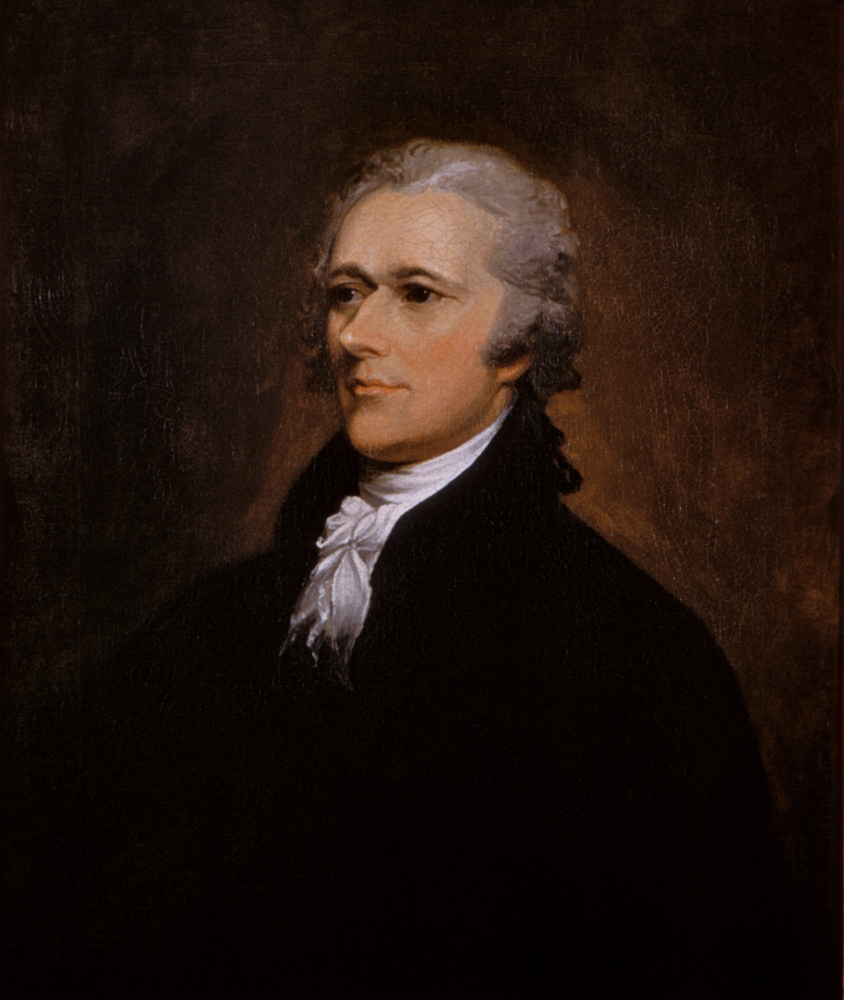
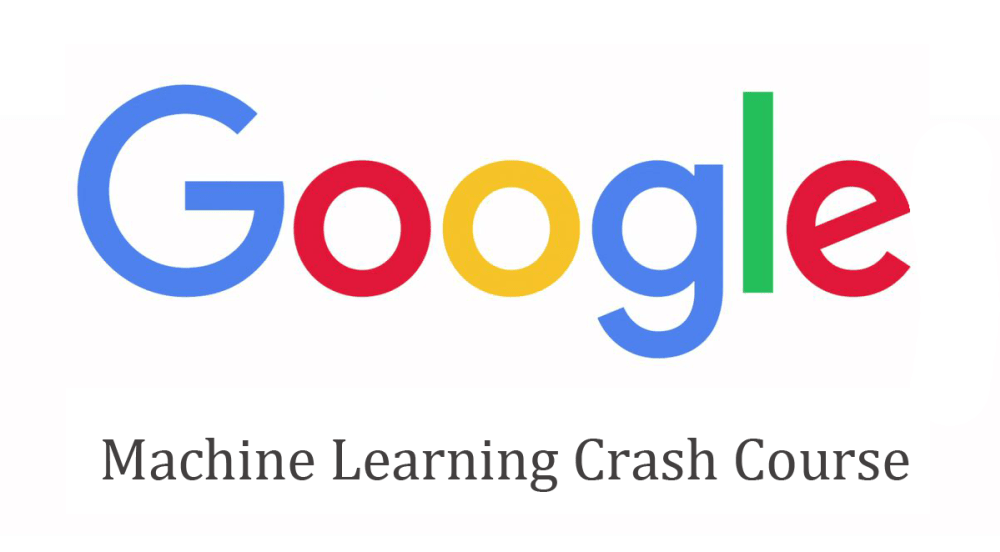

# @size[0.8em](Artificial Intelligence)   @size[0.4em](&)   @size[0.8em](Machine Learning)

---

## Talk Outline

1. Busting myths and misconceptions
2. Real life examples (non-Google ;P)
3. How to get started / involved

---

@div[up-50]

@divend

@div[down-50 fragment]

@divend

+++

@div
`\[
    P(A \mid B) \frac{P(B \mid A) P(A)}{P(B)}
\]`
@divend

 

@div[fragment]
`\[
    P(y_{i} \mid \vec{x}) \propto P(y_i) \prod_{j=1}^{n} P(x^j \mid y_i)
\]`
@divend

 

@div[fragment big-formula]
`\[
    J(\Theta) = - \frac{1}{m} \left [ \sum_{i=1}^{m} \sum_{k=1}^{K} y_{k}^{(i)} \log(h_{\Theta}(x^{i}))_k + (1 - y_{k}^{(i)})log(1 - h_{\Theta}(x^{(i)}))_k \right ] + \frac{\lambda}{2m} \sum_{l=1}^{L - 1} \sum_{i=1}^{s_{l}} \sum_{j=1}^{s_{l + 1}} (\Theta_{ji}^{(l)})^{2}
\]`
@divend

+++

+++

+++

---

+++

@div[left-30]

Alexander Hamilton
@divend

@div[left-30]

John Jay
@divend

@div[left-30]

James Madison
@divend

---

+++

---

---

---

---

+++

+++

---

+++

+++

## Just come and ask me, I'll try to guide as best as I can! :D

---

# Questions?
